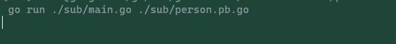
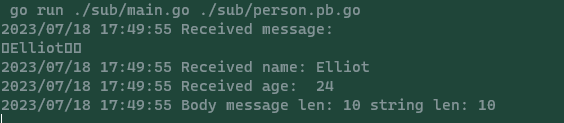

# pubsub by http
## Clone my repository
```
git clone https://github.com/Future-Outlier/pubsub
```
## Start a session in Terminal for Subscriber
```
go run ./sub/main.go ./sub/person.pb.go
```

## Send a message in Terminal for Publisher
```
go run ./pub/main.go ./pub/person.pb.go
```

## Receive output from Publisher

